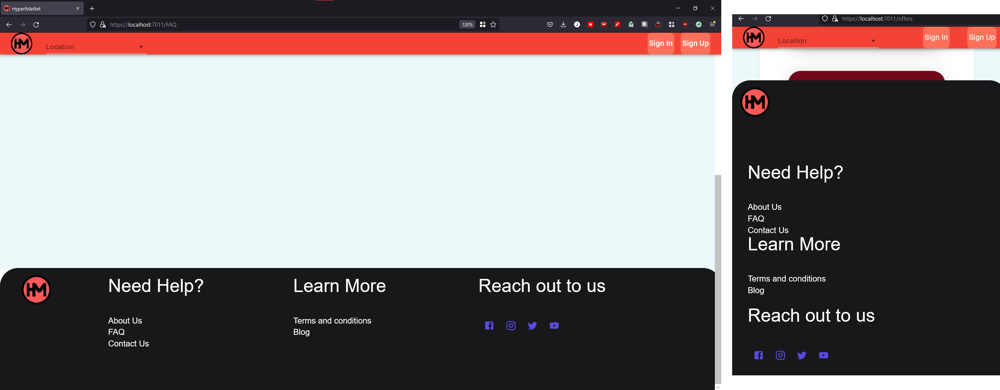
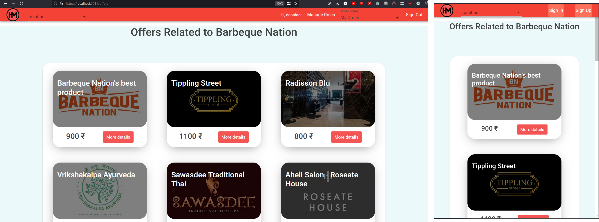
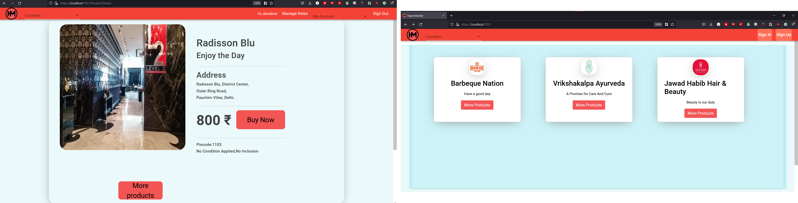

# HyperMarket

- This is a full-stack project based completely on .NET for backend,
and blazor-wasm for the frontend.
- My contribution mainly was with setting up the post routes ,
and designing, implementing the landing page, checkout page, product page.
- following photos illustrate the same
	- #### Footer and its resposnive version
		- 
	- #### Product page and its resposnive version
		- 
	- #### checkout page and main page
		- 

